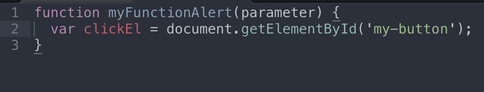

# help-eng
WHS HelpEng Final Project

Project Manager: Not Assigned 
Developers: Dylan Tucker, Kay Calpito, Mark Demesillo, Edsen Casintahan

<h3>Final Project Breakdown</h3>
<b>Assignments and Grading for the 4th quarter</b>
<ul>
  <li>Final project: Minimum of 3 commits a week and Pull request when a task is complete.</li>
  <li>Quizzes: Take home quiz every other week</li>
  <li>Research assignments: Every other week as a medium blog or Journal entry</li>
</ul>

<h3>Daily Scrum</h3>
<b>Teams will meet daily for the first 5-10 mins of class to report the following:</b>
<ul>
  <li>Progress on their feature.</li>
  <li>What they're going to work on that day.</li>
  <li>Any blockages per feature or clarifications they may need.</li>
</ul>

<b>Project Manager reports daily to the instructors the following:</b>
<ul>
  <li>Progress per feature that the group is currently working on.</li>
  <li>Projection as to what will be accomplished by the end of the week.</li>
  <li>Any blockages per feature or clarifications the team may need.</li>
</ul>

<b>Developers are to notify the Project Manager and an instructor when:</b>
<ul>
  <li>A feature is complete</li>
  <li>A pull request is made</li>
</ul>

If there are questions about a feature, code questions, blockages (challenges) please notify an instructor via Slack.

<h3>Formatting Structure</h3>

<b>HTML, CSS, and Project images</b>
<ul>
  <li>File, class and id names should be all lowercase with dashes for spacing (if needed).</li>
  <li>Any nesting must be properly tabbed, and every element should be returned as a new line.</li>
</ul>

<b>Javascript</b>
<ul>
  <li>Function names and variables should be camelcase.</li>
  <li>Any nesting must be properly tabbed. No one liners for multiple lines of code.</li>
  <li>Use block comment when noting a feature.</li>
  <li>Each Javascript feature should have a block comment of psuedo code.</li>
</ul>

<b>Formatting example</b>

<b>Sublime Text</b>
<ul>
  <li>Set spaces: 2</li>
</ul>

<b>Git flow and Github Commit Messages</b>
<b>Git Flow</b>

<b>Github Commit Messages</b>
<ul>
  <li>What was completed, any current bugs.</li>
  <li>Example: ‘completed top navigation in html, links do not work yet’</li>
</ul>

<h2>Task Breakdown - Part 1</h2>

<b>Creating the Views</b>
<ul>
  <li>Follow the design views found under the Assets folder.</li>
  <li>If the view is not the home (first page/index.html), create a new file in the root folder with the view name.</li>
</ul>

<b>Adding CSS</b>
<ul>
  <li>All of the css will be in the css/styles.css</li>
  <li>Assign classes to reusable styles.</li>
  <li>Create a block comment when introducing styles for a feature.</li>
</ul>

<b>User Interactions</b>
<ul>
  <li>All of the javascript will be in the js/app.js</li>
  <li>Start each task with a block comment and include your pseudo code.</li>
  <li>Create array objects of mock data per page and store them in a variable</li>
  <li>Dynamically display mock data per view.</li>
  <li>Create interactive buttons for the top navigation</li>
  <li>Sort - display data based on a keyword. Make the first items data show as default.</li>
</ul>

<h2>Task Breakdown - part 2</h2>
<ul>
  <li>If user clicks delete, remove item</li>
  <li>Create test mock data</li>
  <li>Create test logic to check for correct answers else give correct answer</li>
  <li>Create chrome extension</li>
  <li>Add styles for chrome extension</li>
  <li></li>
</ul>